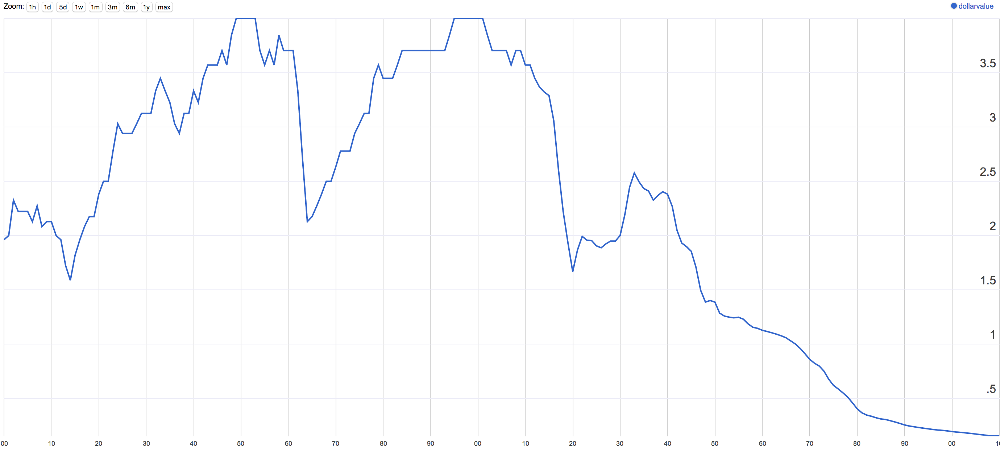

# !$ - BangBuck

## Why?
> 3 a:  any of various basic monetary units (as in the U.S. and Canada)
>
> definition of a dollar via [Mirriam-Webster](https://www.merriam-webster.com/dictionary/dollar)

So, this dollar is a unit of measurement, eh?

Well, I ain't never tried to neither engineer nor construct anything in my life with an impermanent unit of measurement!

Imagine building a house or conducting science when the length of a centimeter fluctuates daily based on the emotional state of panicky people.

            NEWS ACTOR
    ...and today the weight of a kilogram
    backed off from it's high of 1.180 to
    1.167 when reports of unrest in the...

So why BangBuck?

Because we gain a better perspective of currency, value, inflation and more by locking all dollars you see in your browser to a particular spacetime, like _The Universal BangBuck_ of New York, Jan 1 2000 or Bainbridge Island, 2017.
 
Every dollar you see will adjust to your favorite perspective.

`NOTE: Amero-centric and will change any "$".`

## Settings
- Enter your preferred `year` and `city` into the form.
- Refresh the page to see the effect.

## Dollar Value 1800-2010

## Adjusted Dollars
- [Adjusting in time.](http://www.usinflationcalculator.com/)
- [Adjusting in space.](http://www.payscale.com/cost-of-living-calculator)

## TODO
GitHub Issues [here](https://github.com/geoffreypoirier/bangbuck/projects/1)
